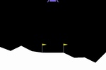
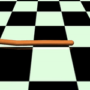
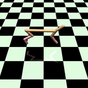
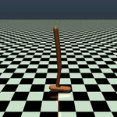
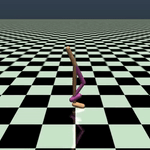

# Guide Actor-Critic
Guide Actor-Critic (GAC) is an actor-critic method for continuous control (links: [OpenReview](https://openreview.net/forum?id=BJk59JZ0b), [arXiv](https://arxiv.org/abs/1705.07606v2)).
This repository contains a Keras implemnetation of the method and experiment setup used in the paper.

## Requirements
The code is tested on Python 3.5.3 with these python packages:
* [keras](https://keras.io/) == 2.1.4
* [tensorflow](https://github.com/tensorflow/tensorflow) == 1.2.1 (Theano and CNTK backends are not supported.)
* [numpy](http://www.numpy.org/) == 1.14.0
* [scipy](https://www.scipy.org/) == 1.0.0
* [gym](https://github.com/openai/gym) == 0.9.1
* [mujoco-py](https://github.com/openai/mujoco-py) == 0.5.7
* [box2d](https://github.com/pybox2d/pybox2d) == 2.3.2

## How to run the code
There are 3 python scripts:
* GAC_learner.py - This script contains the actor and critic updates
* main_exp.py - This script runs a generic training loop.
* main_demo.py - This script loads a trained keras policy model and test it.

### Train an agent by main_exp.py
To train an agent in the Pendulum-v0 environment, run
```
python main_exp.py --env "Pendulum-v0"
```
You can change environment by --env, e.g., python main_exp.py --env "HalfCheetah-v1".
By default, the script trains the agent for 1 million time steps (can be set by --step_max). 
Averaged returns are tested every 1000 time steps and the results are saved in the Result directory. 
Trained policy is saved as a keras model in the Model directory.
The default hyper-parameters and neural network architecture are the same as in the paper.
The results in the paper are obtained using random seeds 1 to 10.

### Visualize a trained agent by main_demo.py
Trained models for some environments are provided in the Model directory.
You can test them by 
```
python main_demo.py --env "Pendulum-v0"
```
This will load a keras neural network model of a trained policy and test it. 
These are some examples:











## License
MIT license

## Reference
Voot Tangkaratt, Abbas Abdolmaleki, Masashi Sugiyama. [Guide Actor-Critic for Continuous Control](https://openreview.net/forum?id=BJk59JZ0b). ICLR, 2018. 
